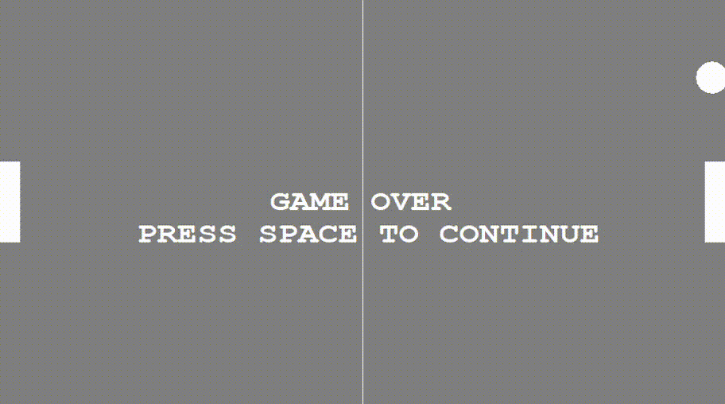

# Ping-Pong-Game
This repository contains ping-pong-ball game developed in C++ using graphics.h. Left player controls are keys A and Z and right player controls are keys UP Arrow key and DOWN Arrow key. 

## Game Play
#### (Gameplay appears to be laggy because its gif)

## Game

## Game Over

